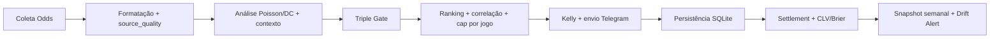

# ⚡ Edge Protocol Bot


Sistema de análise e execução operacional para sinais de apostas esportivas com foco em:

- qualidade estatística (Poisson + Dixon-Coles + xG + SOS),
- controle de risco de portfólio (cap por jogo, correlação, Kelly adaptativo),
- confiabilidade operacional (scheduler idempotente, settlement resiliente, telemetria e alertas).

## 🎯 Objetivo principal
Gerar **menos sinais, porém com maior qualidade e disciplina de risco**, monitorando resultado real (win rate, ROI, Brier, CLV) e reagindo a degradações de performance ao longo do tempo.

---

## ✨ Principais recursos

- 🧠 **Engine de decisão com múltiplos filtros (gates)**
  - EV + no-vig source-aware
  - confirmação de escalação/contexto
  - divergência modelo vs mercado
  - motivação/tabela (cache persistente)

- 📈 **Modelagem estatística com calibração por liga**
  - Poisson com correção Dixon-Coles
  - parâmetro `rho` por liga
  - home advantage por liga

- 🔁 **Scheduler operacional com idempotência**
  - prevenção de execução duplicada por janela (`job_execucoes`)
  - ciclos de análise, verificação de resultados, CLV, steam e resumo diário

- 🛡️ **Risco de portfólio**
  - cap de mercados por jogo
  - penalização de correlação no ranking
  - redutor de Kelly para exposição no mesmo jogo

- 📊 **Telemetria semanal e drift**
  - snapshot semanal em `quality_trends`
  - histórico segmentado (global/mercado)
  - alerta rolling de degradação para Telegram

### Exemplos rápidos de uso

```bash
# Rodar scheduler completo
python scheduler.py

# Rodar um ciclo de análise em modo seguro (sem envio real)
python scheduler.py --dry-run-once

# Rodar suíte de testes canônica
python scripts/run_tests.py

# Recalibrar parâmetros do modelo (histórico)
python calibrar_modelo.py
```

---

## 🧰 Pré-requisitos

- Python 3.10+
- pip
- acesso à internet para provedores de odds/dados
- token/canais de Telegram configurados

Sugestão de versão: Python 3.11/3.12.

---

## 🚀 Instalação

```bash
# 1) Clonar
git clone https://github.com/Leonardo4u/Honeypot.git
cd Honeypot

# 2) Criar ambiente virtual
python -m venv .venv

# 3) Ativar ambiente virtual (Windows PowerShell)
.\.venv\Scripts\Activate.ps1

# 4) Instalar dependências
pip install -r requirements.txt

# 5) Inicializar banco/tabelas (se necessário)
python criar_tabelas.py
```

---

## ⚙️ Variáveis de ambiente

Configure um arquivo `.env` na raiz com:

```env
BOT_TOKEN=seu_token_telegram
CANAL_VIP=@seu_canal_vip_ou_chat_id
CANAL_FREE=@seu_canal_free_ou_chat_id

ODDS_API_KEY=sua_chave_odds_api
API_FOOTBALL_KEY=sua_chave_api_football

# Opcional: verbosidade de log no scheduler: normal | debug
EDGE_LOG_LEVEL=normal
```

### Variáveis usadas no projeto

- `BOT_TOKEN`, `CANAL_VIP`, `CANAL_FREE`: envio de mensagens/sinais
- `ODDS_API_KEY`: coleta de odds e fluxos relacionados
- `API_FOOTBALL_KEY`: atualização de stats/settlement auxiliar
- `EDGE_LOG_LEVEL`: modo de log (`normal` compacta rotina; `debug` mostra detalhes completos)

---

## ▶️ Execução

### Scheduler principal

```bash
python scheduler.py
```

### Dry-run único (sem envio real de sinais)

```bash
python scheduler.py --dry-run-once
```

### Bot de comandos Telegram (modo polling)

```bash
python bot/telegram_bot.py
```

### Geração/atualização de Excel

```bash
python data/exportar_excel.py
```

---

## 🧪 Testes

### Suíte canônica

```bash
python scripts/run_tests.py
```

### Exemplo de suíte específica

```bash
python -m unittest tests.test_quality_telemetry_weekly -v
```

A suíte canônica cobre módulos críticos de gates, scheduler, settlement, qualidade de dados, telemetria e integração de banco.

---

## 🗂️ Estrutura do projeto

```text
edge_protocol/
├── bot/
│   └── telegram_bot.py              # comandos Telegram (/start, /banca, /resultado...)
├── data/
│   ├── coletar_odds.py              # ingestão de odds + source_quality por mercado
│   ├── verificar_resultados.py      # resolução de resultados (fixture/date window)
│   ├── kelly_banca.py               # sizing/controle de banca
│   ├── clv_brier.py                 # métricas de validação pós-sinal
│   ├── quality_telemetry.py         # snapshots semanais + drift rolling
│   ├── database.py                  # schema e operações SQLite
│   └── exportar_excel.py            # geração de relatório Excel
├── model/
│   ├── analisar_jogo.py             # pipeline de análise de jogo
│   ├── filtros.py                   # triple gate e políticas de rejeição
│   ├── poisson.py                   # Poisson + Dixon-Coles
│   └── runtime_gate_context.py      # contexto runtime para gates
├── logs/
│   ├── update_excel.py              # atualizações incrementais no Excel
│   └── relatorio_*.json             # artefatos de execução
├── tests/
│   └── test_*.py                    # suíte de regressão/integridade
├── scripts/
│   └── run_tests.py                 # runner canônico de testes
├── scheduler.py                     # orquestrador principal
├── calibrar_modelo.py               # calibração histórica por liga
├── requirements.txt
└── .planning/                       # roadmap/requirements/phases/evidências
```

---

## 🖼️ Demonstração

> No momento, o repositório não possui GIF oficial de demo.  
> Recomendação: adicionar `docs/demo.gif` com o fluxo `dry-run -> sinais -> settlement -> resumo diário`.

Enquanto isso, um diagrama rápido do fluxo principal:



---

## 🤝 Contribuição

Contribuições são bem-vindas.

1. Abra uma issue descrevendo problema/objetivo.
2. Crie branch a partir de `main`.
3. Faça mudanças pequenas e testáveis.
4. Rode:

```bash
python scripts/run_tests.py
```

5. Abra PR com:
- contexto do problema,
- estratégia adotada,
- impacto esperado,
- evidência de teste.

### Padrão recomendado para PR

- título objetivo (`fix(...)`, `feat(...)`, `docs(...)`)
- escopo pequeno por PR
- sem incluir artefatos gerados (`__pycache__`, `.pyc`, `.db`)

---

## 🔗 Links úteis

- Repositório: https://github.com/Leonardo4u/Honeypot
- Issues: https://github.com/Leonardo4u/Honeypot/issues
- Pull Requests: https://github.com/Leonardo4u/Honeypot/pulls
- Actions (CI/CD): https://github.com/Leonardo4u/Honeypot/actions
- Planejamento do projeto: [.planning](.planning)
- Roadmap atual: [.planning/ROADMAP.md](.planning/ROADMAP.md)
- Requirements atuais: [.planning/REQUIREMENTS.md](.planning/REQUIREMENTS.md)

---

## 📄 Licença

Atualmente o projeto está **sem arquivo de licença formal (`LICENSE`)** no repositório.  
Recomendado definir uma licença explícita (ex.: MIT) para uso e distribuição.

---

## ✅ Estado atual

- Milestone v1.3 concluído em fases operacionais
- suíte de testes estável
- scheduler com logs de verbosidade configurável (`EDGE_LOG_LEVEL`)
- telemetria semanal e alertas de drift ativos
